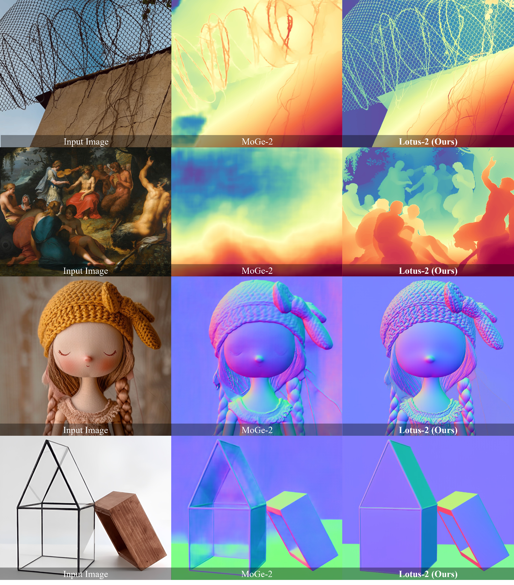

#  Lotus-2: Advancing Geometric Dense Prediction with Powerful Image Generative Model

[](https://lotus-2.github.io/)
[](https://arxiv.org/abs/2512.01030)
[-yellow)](https://huggingface.co/spaces/haodongli/Lotus-2_Depth)
[-yellow)](https://huggingface.co/spaces/haodongli/Lotus-2_Normal)
[](https://huggingface.co/jingheya/Lotus-2/tree/main)

[Jing He](https://scholar.google.com/citations?hl=en&user=RsLS11MAAAAJ)<sup>1</sup>,
[Haodong Li](https://haodong-li.com/)<sup>12<span>&#10033;</span></sup>,
[Mingzhi Sheng]()<sup>1<span>&#10033;</span></sup>,
[Ying-Cong Chen](https://www.yingcong.me/)<sup>13&#9993;</sup>

<span class="author-block"><sup>1</sup>HKUST(GZ)</span>
<span class="author-block"><sup>2</sup>UC San Diego</span>
<span class="author-block"><sup>3</sup>HKUST</span><br>
<span class="author-block">
    <sup>&#10033;</sup>Both authors contributed equally.
    <sup>&#9993;</sup>Corresponding author.
</span>



**We present Lotus-2, a two-stage deterministic framework for monocular geometric dense prediction.** Our method leverages pre-trained generative model as a deterministic world prior to achieve **new state-of-the-art accuracy** while requiring **remarkably minimal data** (trained on only **0.66%** of the samples used by MoGe-2). This figure demonstrates Lotus-2's robust zero-shot generalization with sharp geometric details, especially in challenging cases like oil paintings and transparent objects.

🚀🚀🚀 **Please also check the** [**Project Page**](https://lotus3d.github.io/) **and** [**Github Repo**](https://github.com/EnVision-Research/Lotus) **of our prior work: Lotus!** 🚀🚀🚀

## 📢 News
- 2025-12-01: [Paper](https://arxiv.org/abs/2512.01030) released! <br>
- 2025-11-28: The inference code and HuggingFace demo ([Depth](https://huggingface.co/spaces/haodongli/Lotus-2_Depth) & [Normal](https://huggingface.co/spaces/haodongli/Lotus-2_Normal)) are available! <br>

## 🛠️ Setup
This installation was tested on: Ubuntu 20.04 LTS, Python 3.10, CUDA 12.3, NVIDIA A800-SXM4-80GB.  
1. Be sure you have a GPU with at least **40GB** memory.
2. Clone the repository (requires git):
   ```
   git clone https://github.com/EnVision-Research/Lotus-2.git
   cd Lotus-2
   ```
3. Install dependencies (requires conda):
   ```
   conda create -n lotus2 python=3.10 -y
   conda activate lotus2
   pip install -r requirements.txt 
   ```
4. Be sure you have access to [`black-forest-labs/FLUX.1-dev`](https://huggingface.co/black-forest-labs/FLUX.1-dev).
5. Login your huggingface account via (if you want to switch account, run `hf auth logout` at first):
   ```
   hf auth login
   ```

## 🤗 Gradio Demo

1. Online demo: [Depth](https://huggingface.co/spaces/haodongli/Lotus-2_Depth) & [Normal](https://huggingface.co/spaces/haodongli/Lotus-2_Normal)
2. Local demo:
- For **depth** estimation, run:
    ```
    python app.py depth
    ```
- For **normal** estimation, run:
    ```
    python app.py normal
    ```

## 🕹️ Inference
1. Place your images in a directory, for example, under `./assets/in-the-wild_example` (where we have already prepared several examples). 
2. Run the inference command:
   ```
   sh infer.sh
   ```
- <b> Note</b>: The inference code will automatically download the required model weights. You also can download them manually using the HuggingFace CLI:
   ```
   hf download jingheya/Lotus-2 --local-dir <path/to/your/local/directory>
   ```
   Use the following arguments to specify the paths: `--core_predictor_model_path`, `--lcm_model_path`, and `--detail_sharpener_model_path`.

## 🚀 Evaluation
1. Prepare benchmark datasets:
- For **depth** estimation, please download the [Marigold evaluation datasets](https://share.phys.ethz.ch/~pf/bingkedata/marigold/evaluation_dataset/) via:
    ```
    cd datasets/eval/depth/
    
    wget -r -np -nH --cut-dirs=4 -R "index.html*" -P . https://share.phys.ethz.ch/~pf/bingkedata/marigold/evaluation_dataset/
    ```
- For **normal** estimation, please (manually) download the  [DSINE evaluation datasets](https://drive.google.com/drive/folders/1t3LMJIIrSnCGwOEf53Cyg0lkSXd3M4Hm?usp=drive_link) (`dsine_eval.zip`)  under: `datasets/eval/normal/` and unzip it. 
2. Run the evaluation command (modify the `TASK_NAME` in `eval.sh` to switch tasks):
   ```
   sh eval.sh
   ```

## 🎓 Citation
If you find our work useful in your research, please consider citing our paper:
```bibtex
@article{he2025lotus,
  title={Lotus-2: Advancing Geometric Dense Prediction with Powerful Image Generative Model},
  author={He, Jing and Li, Haodong and Sheng, Mingzhi and Chen, Ying-Cong},
  journal={arXiv preprint arXiv:2512.01030},
  year={2025}
}
```
